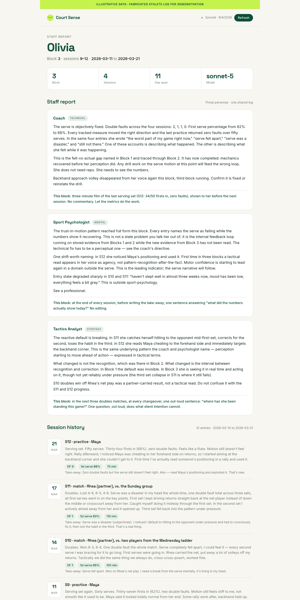

# Personal Intelligence

**Give an LLM your daily narrative for long enough and it will find what you can't: the pattern across sessions, not the noise inside one.**

This is a working system, not a template. Eleven weeks of tennis practice went in as voice notes. What came out was a diagnosis no single session could have produced: the problem was never the serve mechanics, it was trust in a motion that already worked. The system saw it in the log before the player felt it on court.



Three parts, all in this repo:

1. **Ingest.** A voice or text dump goes in; a structured entry comes out and lands in Notion. Same four sections every time, because consistency is what makes cross-session reading possible.
2. **Synthesis.** Every N sessions, three personas (coach, sport psychologist, tactics analyst) read the whole log and each write one section of a Staff Report. An earlier version had five; physio and nutritionist were cut because their data was too thin to earn a standing voice.
3. **Dashboard.** A one-page view built from the synthesis output: block metadata, three persona sections, and the session log.

Tennis is the worked example. Nothing here is tennis-specific except the personas and the sample data.

## Run it

```bash
git clone https://github.com/oliviameng/personal-intelligence.git
cd personal-intelligence
pip install -r requirements.txt
export ANTHROPIC_API_KEY=sk-ant-...           # required
export SYNTHESIS_MODEL=claude-sonnet-5        # optional; default is sonnet-5
python3 ingest/log_session.py --demo          # raw dump -> structured entry
python3 synthesis/run.py --demo               # runs three personas over Block 3
python3 -m http.server 8000                   # then open http://localhost:8000/dashboard/
```

The repo ships with a pre-generated `synthesis/output/latest.json` so the dashboard renders without an API key. Running `synthesis/run.py --demo` overwrites it with a fresh call.

## What's in the box

| Folder | What it is |
| --- | --- |
| `protocol/` | The entry framework and synthesis protocol as plain documents. Read these first. |
| `prompts/` | Persona prompts for the synthesis panel. The intellectual core; edit freely. |
| `ingest/` | Dump-to-entry script, writes to Notion. |
| `synthesis/` | Every-N-sessions job producing Coach's Notes and the Staff Report. |
| `dashboard/` | Static HTML that reads `synthesis/output/latest.json`. |
| `sample_data/` | A fabricated athlete. Twelve entries, two prior synthesis reports. |
| `evals/` | Five adversarial cases + model-assisted runner. Results in `evals/RESULTS.md`. |
| `scripts/ip_scan.py` | Pre-commit scan that blocks employer or personal references from ever being committed. |

## Why this is product work, not model work

No fine-tuning. No RAG pipeline. No agent framework. The entire lift is in three decisions: what shape the input takes, when synthesis runs, and how much judgment the panel gets before a human reads it. Get those right and a frontier model does the rest. Get them wrong and no model saves you.

Longer version: [essay on Soft Intelligence](https://substack.com/@oliviaxmeng).

## Privacy

The sample data is invented. My real journal is not in this repository and never will be. If you run this on your own life, keep exports in `private/` (gitignored) and enable the pre-commit hook (`docs/SETUP_HOOK.md`).

## License

Apache-2.0.

---

*Personal project. Built on my own time with my own tools; not affiliated with or endorsed by any employer.*
